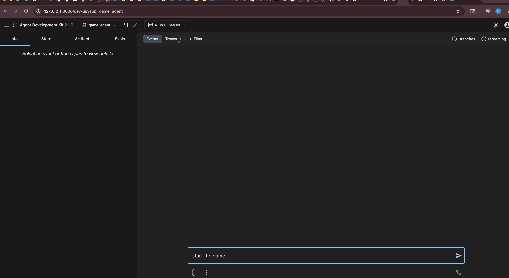

# google-adk
A Google Agent Development Kit practice project that implements a friendly guessing-game agent.

## What this agent does
- Creates a number-guessing game using `get_random_number()`.
- Evaluates player guesses with `evaluate_guessing_game()`.
- Compares two game rounds using `decide_winner()` to choose a winner, loser, or tie.
- Uses the Gemini model via `google.adk.agents.llm_agent.Agent` for game-style feedback and encouragement.

## Key files
- `game_agent/agent.py` — main agent configuration and helper functions.
- `README.md` — this documentation.
- `venv/` — local Python virtual environment.

## How to start the agent
1. Open a terminal in the project root: `/Users/riyaz/google-adk`
2. Activate the Python virtual environment:
   - macOS / Linux: `source venv/bin/activate`
   - Windows PowerShell: `venv\Scripts\Activate.ps1`
3. Run the agent development server:
   - `adk web`
4. Or run the agent directly from the CLI:
   - `adk run game_agent`

## Optional setup notes
- If you have not installed dependencies yet, install them in the venv first. For example:
  - `pip install google-adk`
  - or `pip install -r requirements.txt` if you add a requirements file later.
- If you see quota or API issues, verify your Google AI / Gemini credentials and billing.

## Screenshot

> The screenshot above is loaded from `guess_me.png` in the repository root.

## Tips for end users
- Start by activating the virtual environment.
- Use `adk web` to open the local development UI and inspect agent traces.
- Use `adk run game_agent` to execute the game agent directly in the terminal.
- The agent is designed to respond with hints and compare two games to decide a winner based on the number of attempts.
